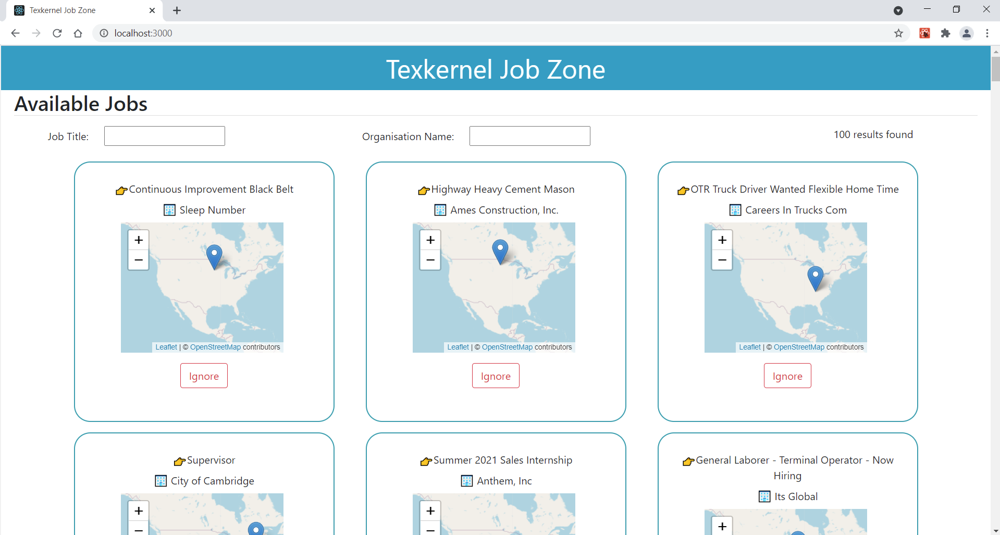

# Textkernel Assignment Project
This project has been developed by Cem Eroglu for Textkernel

## Installing Steps
  Make sure Node.js is installed to your computer.(https://nodejs.org/en/) 
  Clone the project from my Git repository. Command: git clone https://github.com/CemEroglu/Textkernel_Assignment_Cem_Eroglu.git  
  You can also find from my Github account: https://github.com/CemEroglu  
  Change directory to the project folder: cd Textkernel_Assignment_Cem_Eroglu  
  Run " npm install " to install node_modules.  
  Run "npm start" to start the project. It will open a window on your default browser automatically. You can also view http://localhost:3000/ on your browser.  

## Running Tests
  After installation of node_modules, you can run "npm run test" and press "a" to start running all tests.  

## Overview
After setting up everything, the project should seem like below. It has two filtering inputs on the top left and infofield for the count of search result.

## Filtering
You can filter vacancies by job title or organization name. If you haven't filter by organization, unknown organizations also be shown.

## Multi Filtering
You can also filter vacancies by job title and organization name at the same time.

## Ignoring
You can ignore vacancies if it's not for you. It will not be shown for the rest of your session.

## Coummunication
You can reach me via my e-mail for anything related: cemeroglu96@gmail.com
